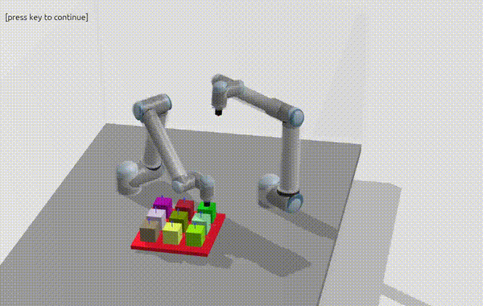
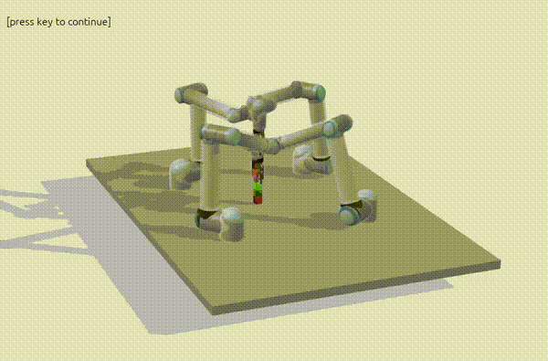
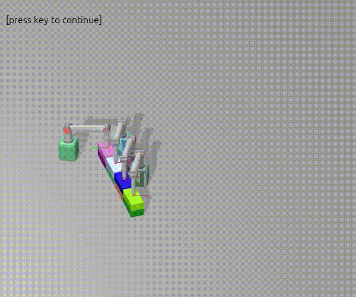

# Benchmarks for multi robot multi goal motion planning

This repository provides some multi-robot-multi-goal motion planning problems, and some baseline-planners.
There are also some utilities for visualizing plans, and plotting convergence and success rates of planners.

The corresponding paper can be found [here](https://vhartmann.com/assets/mrmg/a_benchmark_for_mr_mg_pf.pdf), and more videos can be seen on the [paper website](https://vhartmann.com/mrmg-planning/).

# Installation
Most of the problems we propose here are originally built on top of [rai](https://marctoussaint.github.io/robotic/index.html) ([github](https://github.com/MarcToussaint/robotic)). We would recommend using the virtual environment of your choice to make sure nothing break with rai.

After cloning, and setting up the virtual env, the installation of all the required dependencies can be done with

```
python3 -m pip install -e .[all]
```

which also installs this module.
You can choose whatever backends you want. [all] gives you all of them, but [pin], [mujoco] or [rai] is possible as well and installs only the chosen environments.

This also works with uv (and is definitely quite a bit faster).
The command
```
uv sync --extra all
```
Does the same thing as the command above, and is recommended. In that case, the commands below need to be adapted to use `uv run [rest of the command]`.

After the installation, you can run 
```
python3 examples/run_planner.py abstract.test  --max_time=10 --optimize
```
to test if the installation went well.
This runs one of the abstract environments that do not require any more fancy backend with the default planner.
After it finished, it shows an animation of the found path.

# Overview and Usage

We formulate some multi-robot multi-goal motion planning problems, and provide some baselines and base-classes to formulate your own problems.
At the moment, all of this is implemented using python, with collision checks and other performance critical parts happening in rai (or in the backend of your choice).

The structure of the benchmark should however make it easy to swap out this backend with any other backend which would e.g., allow for parallelization, and usage of your favorite framework.

## Examples
Currently, there are 21 base scenarios, of which most can be adjusted in difficulty by changing the number of robots and objects that we need to deal with.

Videos illustrate the types of problems we are interested in best:



More examples can be seen with

```
python3 examples/show_problems.py --mode list_all
```

and 

```
python3 examples/show_problems.py [env_name] --mode modes
```

to see a specific environment and all its subgoals.

## Getting started

A planner can be run with 

```
python3 examples/run_planner.py [env] [options]
```

which runs the default planner on the environment with the default configuration. A concrete example would be

```
python3 examples/run_planner.py rai.2d_handover --optimize --max_time=50 --distance_metric=euclidean --per_agent_cost_function=euclidean --cost_reduction=max
```

All options that can be set with a configuration file can also be set in the command line via `[planner_prefix].[option]`, e.g. `--rrt.shortcutting = False`.

An experiment (i.e., multiple runs of multiple planners or of the same planner with multiple options) can be run with 

```
python3 ./examples/run_experiment.py [path to config]
```
as a demo how such a config file can look, we suggest the files in confg/demo.

An environment and its modes can be inspected with

```
python3 examples/show_problems.py [environment name] --mode modes
```

#### Exporting plots
Once an experiment finished (or even before), you can produce the success/cost evolution plots with 

```
python3 examples/make_plots.py [path_to_experiment_folder]
```
There are a couple of flags to save the plot if desired, and to possibly change the style (`--png --use_paper_style --save`).

#### Exporting/Making videos
A path can be visualized  and possibly exported (using `--export`) with the command below assuming that the path was saved before (with `--save` for `run_planner.py` for example.)

```
python3 examples/display_single_path.py [filename] [environment_name]
```

The images are saved to the folder `z.vid`, and can be concatenated to a video with 

```
ffmpeg -framerate 30 -i %04d.png -c:v libx264 -pix_fmt yuv420p out.mp4
```

(ran in the folder above).

## Planners
Currently, for the optimal planners, we have implementations of RRT, Bidirectional RRT, PRM, AIT and EIT.
As baselines for suboptimal planners, we implemented prioritized planners, and receding horizon planning versions of the optimal planners.

## Problem description

#### Nomenclature

- **Configuration**: A configuration describes the joint-pose that all robots are in.
- **Task**: A task specifies the robots that are involved, a goal (which can be a single pose, a region, or a set of constraints)
- **Mode**: A mode describes what each robot is doing at a time.
- **Path**: A path maps time (or an index) to a configuration for each robot, and a mode.

#### Problem & Formulation

The basic formulation is the following: We assume that we have $n$ robots that have to fulfill some tasks.
We assume that the tasks are assigned to a robot, and in the current state, a task essentially means to reach a goal pose (compared to e.g., fulfilling a constraint along a path).

We then propose two scenarios of how task ordering can be specified:
- using a sequence, i.e., a total ordering of all tasks, i.e., task $A$ has to be done before task $B$
- using a dependency graph, which only tells us an ordering for some of the tasks.

The goal of a planner is then to find a path for all robots that fulfills the tasks at hand.
A path consists of a configuration for all robot at a time-index, and the index of the task that each robot is currently doing.

#### Files

- `planning_env.py` implements the abstract base class for a planning problem.
There are two main requirements:
  - we need a scene that we are planning in, and
  - we need a description of the task sequence, respectively the dependence between tasks

- `rai_envs.py` implements some concrete environments, and some utilities to have a look at them.

#### Using your own robot environment

To implement your own problem, you need to implement the required functions of the `env` base-class.

There are three examples that implement other environments than the rai-based ones. There is an abstract environment, which is _extremely_ basic, and a slightly more complex version that shows how [pinocchio](https://github.com/stack-of-tasks/pinocchio) can be used.
Mujoco is also supported as backend.

#### Specifying your own problems

A problem consists of 
- the initial scene, and 
- a description of the task ordering. This can be a task sequence or a dependency graph, or a set of tasks that need to be done, and dependencies between them.

#### Implementing your own planner

To implement your own planner, you need to specialize the `planner` base-class, as the other planners do.
The only required method is the `plan()`-function, which takes the termination criterion as argument.
It has to return two things: the final path, and a dict containing some information, which is then exported.
The information that is needed for plots, is a list of all paths that were found, a list of their corresponding costs and a list of the times at wich they were found.

# Tests
There are initial tests in the `tests/` folder.
This could and should be expanded.

# Benchmarking

You can run the commands above for running a planner, and generate a profile while running it with

```
python3 -m cProfile -o res.prof  examples/run_planner.py [env] [options]
```

The resulting profile can be visualized with `snakeviz res.prof`.

Alternatively, `kernprof` provides line-by-line profiling, by simply adding `@profile` as decorator to the function of interest, and running planner via

```
kernprof -l  examples/run_planner.py [env] [options]
```

# Extension & Future work

#### Path constraints
This framework technically supports both path and goal constraints, but at the moment, only goal constraints are implemented and used.
However, in some applications, this is necessary to e.g. formulate a constraint of 'hold the glass upright'

#### Kinodynamic motion planning
Similarly as above, the formulation we propose here allows for kinodynamic motion planning, but we do not have a scene at the moment that tests this.

#### C++ implementations of planners
We noted that the more complex planners (EIT/AIT/sometimes PRM) spend much time in python operations.
Ideally those types of operations should not be the bottleneck of the planner.
Thus, we feel like it makes sense to port much of this benchmark to cpp.

#### More backends
This should be somewhat self explanatory: I want to have parallelized (faster) backends for collision checking. 
Warp seems promising, Mujoco MJX, or Genesis also seem fun.
I assume tht much of the python bottleneck would become worse in those settings, if the collision checking is not the bottleneck anymore.

#### More scenarios
We are currently covering many aspects in multi-arm manipulation/planning, but less so in mobile manipulation.
Further, more long horizon scenarios would be fun.

#### More planners
Long horizon tasks and large robot teams are currenly difficult for the planners for the reason that we do plan in composite space over the full horizon.
While that gives us optimality, and completeness, this makes the planner slow in those settings.
The prioritized planner already shows what might be possible for a suboptimal planner.
Some e.g. receding horizon planner that plans in the composite space might be a nice compromise.

### More concrete TODOs
Some of these could be PRs:

- [ ] Document implementation of the own planner better.
- [ ] Document implementation of an own environment/problem better.
- [ ] Planner cleanup: Many of the planners have a mix of historic experimentation still in them. Much of that can and should be removed.
- [ ] Extend abstract environment
  - [ ] Parallel collision checking
  - [ ] More complex (3D/robot) scenarios (using JAX?)
- [ ] Implement support for Genesis/Isaac(?) as backend
- [ ] More cost functions (such as clearance) to minimize

# Citation
If you use this codebase in your research, please cite
 
```
@article{hartmann2025benchmark,
  title={A Benchmark for Optimal Multi-Modal Multi-Robot Multi-Goal Path Planning with Given Robot Assignment},
  author={Hartmann, Valentin N and Heinle, Tirza and Coros, Stelian},
  journal={arXiv preprint arXiv:2503.03509},
  year={2025}
}
```

# Acknowledgements
The benchmark contains some problems (and data) from previous work, mostly from 
- ["Cooperative Task and Motion Planning for Multi-Arm Assembly Systems"](https://arxiv.org/pdf/2203.02475)
- ["Human-Robot Interaction - Workshop at Design Modeling Symposium 2024"](https://infoscience.epfl.ch/entities/publication/26958110-4f6b-4762-bccb-63ecf36c7725)
